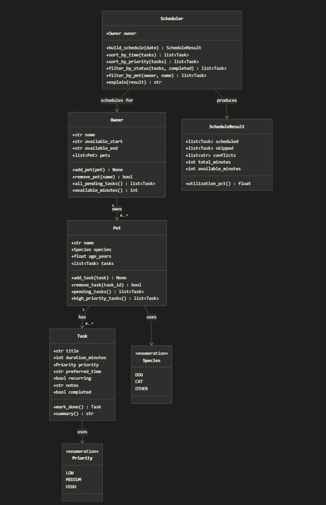

# 🐾 PawPal+

A smart pet care scheduling assistant that helps owners plan daily care
tasks for their pets based on priority, time constraints, and preferences.

---

## 📸 Demo

<!-- Replace the src below with your actual screenshot path once captured -->
<a href="/pawpall_screenshot.png" target="_blank">
  
</a>

---

## 🚀 Getting Started

### Prerequisites

- Python 3.10 or higher
- pip

### Installation

```bash
# 1. Clone the repo
git clone https://github.com/YOUR-USERNAME/pawpal-plus.git
cd pawpal-plus

# 2. Install dependencies
pip install streamlit pytest

# 3. Run the app
streamlit run app.py
```

### CLI verification (optional)

Before launching the UI, you can verify the backend logic in the terminal:

```bash
python demo.py
```

---

## 🗺️ System Architecture

PawPal+ is built around five classes with a clear separation between
data (Owner → Pet → Task) and logic (Scheduler):



| Class | Responsibility |
|---|---|
| `Task` | A single care activity — title, duration, priority, recurrence |
| `Pet` | Owns a list of tasks; provides filtered views (pending, high-priority) |
| `Owner` | Owns a list of pets; defines the daily availability window |
| `Scheduler` | Reads from Owner, assigns time slots, detects conflicts |
| `ScheduleResult` | Typed return object holding the completed daily schedule |

---

## ✨ Features

### Priority-first scheduling

Tasks are sorted **HIGH → MEDIUM → LOW** before time slots are assigned.
Within the same priority level, shorter tasks are placed first. This
guarantees the most important care always happens, even on a short day.

### Preferred-time hints

Tasks can carry a soft time-of-day preference (`morning`, `afternoon`,
`evening`). The scheduler respects these hints where possible but treats
them as suggestions — a HIGH priority task will always be placed even if
its preferred slot is already full.

### Conflict detection

After building the schedule, every pair of tasks is checked for overlapping
durations. Conflicts are returned as human-readable warning strings — the
app never crashes on a conflict, it warns and continues.

### Recurring task automation

Tasks marked `recurring=True` automatically generate the next day's
occurrence when marked complete, using Python's `timedelta(days=1)`.
Daily care routines only need to be entered once.

### Sorting and filtering

The `Scheduler` exposes four helper methods used by the UI:

| Method | What it does |
|---|---|
| `sort_by_priority(tasks)` | HIGH → LOW, ties by shortest duration |
| `sort_by_time(tasks)` | Chronological by `scheduled_start` |
| `filter_by_status(tasks, completed)` | Done or pending tasks only |
| `filter_by_pet(owner, name)` | Tasks belonging to one specific pet |

---

## 🧠 Smarter Scheduling

### The algorithm

The scheduler uses a **greedy, first-fit** approach:

1. Collect all pending tasks from all pets
2. Sort by priority (HIGH first), break ties by shortest duration
3. Assign each task the next available time slot, respecting preferred-time hints
4. Skip any task that would overflow the availability window
5. Detect overlapping durations and surface warnings

### Tradeoff

A single large HIGH priority task can push out several smaller MEDIUM tasks
even if those smaller tasks could have collectively fit. This is intentional
— simplicity and predictability matter more than optimality for a daily
pet-care schedule. An owner can always read the output and understand
exactly why each task landed where it did.

---

## 🧪 Testing PawPal+

### Running the tests

```bash
python -m pytest tests/ -v
```

Expected output: **27 passed**

### What the tests cover

| Test class | Behavior verified |
|---|---|
| `TestTaskCompletion` | `mark_done()` flips flag; completed tasks leave pending list |
| `TestTaskAddition` | `add_task()` grows count; task visible in both lists |
| `TestSorting` | Priority descending; duration tiebreak; chronological time sort |
| `TestRecurrence` | Next-day clone created; chain stays recurring; safe with no start time |
| `TestConflictDetection` | Overlaps flagged; back-to-back tasks clean; greedy output conflict-free |
| `TestEdgeCases` | Empty pet; short window; utilization math; filter by pet |

### Confidence level

⭐⭐⭐⭐ 4 / 5 — High confidence in core behaviors. Cross-feature interaction
tests (e.g. recurring clone conflicting with an existing next-day task) would
be the next additions given more time.

---

## 📁 Project Structure

```
pawpal-plus/
├── app.py              # Streamlit UI — all user-facing screens
├── pawpal_system.py    # Backend logic — Owner, Pet, Task, Scheduler
├── demo.py             # CLI verification script
├── uml_final.md        # Final Mermaid.js class diagram
├── uml_final.png       # Exported diagram image
├── reflection.md       # Project reflection and design decisions
├── tests/
│   ├── __init__.py
│   └── test_pawpal.py  # Full pytest suite (27 tests)
└── README.md
```

---

## 🤝 Built With

- [Python 3.10+](https://www.python.org/)
- [Streamlit](https://streamlit.io/) — UI framework
- [pytest](https://pytest.org/) — testing
- [GitHub Copilot](https://github.com/features/copilot) — AI pair programming