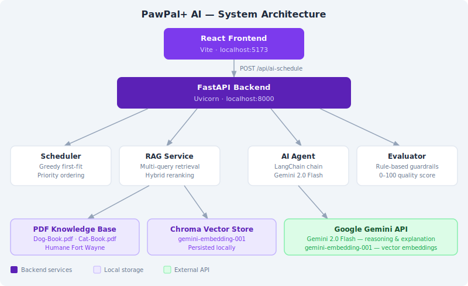

# PawPal+ AI

An AI-powered pet care scheduling assistant. Owners register their pets, add daily care tasks, and receive an intelligently explained schedule — backed by a Gemini language model, a semantic vector knowledge base, and a rule-based guardrail layer.

---

## Original Project

PawPal+ was originally built in Modules 1–3 as a pure rule-based pet care scheduler. Owners could register their pets, add daily care tasks (with priority levels and preferred time windows), and receive an automatically ordered schedule produced by a greedy first-fit algorithm. The original system had no AI component — every scheduling decision was fully deterministic and explainable by the algorithm alone. This AI extension adds semantic document retrieval, a LangChain-powered Gemini agent, and a rule-based guardrail evaluator layered on top of that same unchanged scheduling core.

---

## Demo Walkthrough

> **Loom video:** [Watch the walkthrough](https://www.loom.com/share/8cbf46591cb5407088686f561bffa6eb)


The video shows three end-to-end runs: a normal dog schedule, a cat medication schedule, and an overloaded schedule that triggers guardrail failures. It demonstrates the RAG passage panel, the guardrail score, and the AI reasoning output.

See [Sample Interactions](#sample-interactions) below for the written versions of these same scenarios.

---

## System Architecture




**Data flow:**
1. User fills in owner, pets, and tasks in the React UI
2. Clicking "Generate AI Schedule" sends a POST to `/api/ai-schedule`
3. The Scheduler builds a greedy time-slot assignment
4. The RAG Service runs multi-query semantic search against the species-filtered Chroma vector store, returning the top passages from the PDF care guides
5. The AI Agent passes the schedule + retrieved passages through a LangChain chain to Gemini 2.0 Flash, which returns structured JSON (reasoning, explanation, recommendations)
6. The Evaluator applies rule-based guardrails and produces a 0–100 quality score
7. All results are returned in a single response and rendered in the UI

---

## Features

### Core scheduling
- **Priority-first ordering** — HIGH tasks always placed before MEDIUM or LOW
- **Preferred-time hints** — soft constraints for morning / afternoon / evening
- **Conflict detection** — every task pair checked; overlaps surfaced as warnings
- **Recurring tasks** — completing a recurring task queues its next-day clone
- **Skip tracking** — tasks that overflow the window are listed separately

### AI layer
- **Semantic RAG** — PDF pet care guides (Dog-Book.pdf, Cat-Book.pdf from Humane Fort Wayne) are chunked, embedded with `gemini-embedding-001`, and stored in a persistent Chroma vector store. Per-pet retrieval runs multi-query search + hybrid reranking for the most relevant passages.
- **Per-pet context** — each pet's species, age, tasks, and notes drive independent retrieval queries. Retrieved passages are shown in a collapsible panel per pet in the UI.
- **LangChain AI agent** — `ChatGoogleGenerativeAI` + `ChatPromptTemplate` + `StrOutputParser` chain calls Gemini 2.0 Flash with the full schedule context and retrieved passages, returning structured JSON.
- **Guardrail evaluator** — rule-based validation scores the schedule 0–100 and surfaces blocking issues (skipped HIGH tasks, conflicts) and warnings (utilisation extremes) independent of the LLM.

---

## Project Structure

```
applied-ai-system-project/
├── requirements.txt
├── .env                        ← GEMINI_API_KEY goes here
├── assets/
│   └── architecture.svg        ← System architecture diagram
│
├── backend/
│   ├── pawpal_system.py        Core domain — Owner, Pet, Task, Scheduler
│   ├── run_api.py              Starts the FastAPI/Uvicorn server
│   ├── evaluate.py             8-case automated test harness
│   ├── main.py                 FastAPI route definitions
│   ├── schemas.py              Pydantic request/response models
│   ├── services/
│   │   ├── ai_agent.py         LangChain chain → Gemini 2.0 Flash
│   │   ├── rag.py              Semantic RAG — Chroma + Gemini embeddings
│   │   └── evaluator.py        Rule-based guardrail layer
│   └── data/
│       ├── Dog-Book.pdf        Humane Fort Wayne dog care guide
│       ├── Cat-Book.pdf        Humane Fort Wayne cat care guide
│       └── chroma_db/          Persisted vector store (auto-generated)
│
├── model_card.md               AI collaboration & ethics reflection
│
└── frontend/
    ├── src/
    │   ├── App.jsx
    │   ├── App.css
    │   ├── index.css
    │   ├── components/
    │   │   ├── OwnerSetup.jsx
    │   │   ├── PetManager.jsx
    │   │   ├── TaskManager.jsx
    │   │   └── ScheduleView.jsx
    │   └── services/
    │       └── api.js
    ├── package.json
    └── vite.config.js
```

---

## Sample Interactions

### Interaction 1 — Normal dog schedule

**Input:**
- Owner: Alex | Window: 8:00 AM – 8:00 PM
- Pet: Buddy (Dog, 3 yrs)
- Tasks: Morning Walk (30 min, HIGH, morning), Feeding (15 min, HIGH, morning), Playtime (20 min, MEDIUM), Evening Walk (25 min, HIGH, evening)

**Schedule output:**
```
08:00 AM — Morning Walk     (30 min, HIGH)
08:30 AM — Feeding          (15 min, HIGH)
08:45 AM — Playtime         (20 min, MEDIUM)
05:00 PM — Evening Walk     (25 min, HIGH)

Scheduled: 4  |  Skipped: 0  |  Time used: 90 min  |  Utilization: 12.5%
```

**Guardrail:** ✅ Passed — Score: 95/100
*Warning: Only 12.5% of your window is used — consider adding more tasks.*

**AI Explanation:** "Buddy's day is well-organized! The morning walk is placed before feeding, which aligns with the care guide's recommendation to avoid exercise immediately after eating. All high-priority tasks are covered, and the evening walk is correctly placed in the evening time slot."

**AI Recommendations:**
- "Wait 30–60 minutes after feeding before vigorous exercise to reduce the risk of bloat in dogs"
- "Two walks daily support healthy digestion, weight management, and behavioral balance"
- "Keep fresh water available at all times, especially after exercise and meals"

---

### Interaction 2 — Cat with medication

**Input:**
- Owner: Sam | Window: 9:00 AM – 6:00 PM
- Pet: Luna (Cat, 5 yrs)
- Tasks: Medication (10 min, HIGH), Feeding (15 min, HIGH), Grooming (25 min, MEDIUM), Litter Box (10 min, LOW)

**Schedule output:**
```
09:00 AM — Medication       (10 min, HIGH)
09:10 AM — Feeding          (15 min, HIGH)
09:25 AM — Grooming         (25 min, MEDIUM)
09:50 AM — Litter Box       (10 min, LOW)

Scheduled: 4  |  Skipped: 0  |  Time used: 60 min  |  Utilization: 11.1%
```

**Guardrail:** ✅ Passed — Score: 95/100

**AI Explanation:** "Luna's morning routine is efficient and thoughtfully ordered. Medication first ensures it isn't forgotten, followed immediately by feeding — which can help with palatability. Grooming is a great bonding activity after meals when cats are relaxed."

**AI Recommendations:**
- "Administer medication with a small amount of food to improve tolerance if Luna is resistant"
- "Regular grooming sessions reduce hairball risk — focus on the back, belly, and behind the ears"
- "Scoop the litter box daily; cats are highly sensitive to cleanliness and may avoid a dirty box"

---

### Interaction 3 — Overloaded window (guardrail failure)

**Input:**
- Owner: Jordan | Window: 9:00 AM – 9:30 AM (30 min total)
- Pet: Rex (Dog, 2 yrs)
- Tasks: Morning Walk (30 min, HIGH), Feeding (15 min, HIGH), Grooming (20 min, HIGH)

**Schedule output:**
```
09:00 AM — Morning Walk     (30 min, HIGH)

Scheduled: 1  |  Skipped: 2  |  Time used: 30 min  |  Utilization: 100%
```

**Guardrail:** ❌ Issues Found — Score: 60/100
- *Issue: 2 HIGH priority task(s) could not fit: 'Feeding', 'Grooming'*
- *Warning: Schedule is 100% full — no buffer for tasks that run over time.*

**AI Explanation:** "Rex's care window is too tight to fit all three essential tasks. The morning walk was prioritized first as the highest-weight HIGH task, but feeding and grooming had no remaining time. A 30-minute window is not enough for a full care routine — aim for at least 60–90 minutes to cover all HIGH-priority needs."

**AI Recommendations:**
- "Extend your availability window or split tasks between morning and evening sessions"
- "Feeding is critical and should never be skipped — if time is limited, prioritize feeding and a shorter walk"
- "Grooming can be scheduled on alternate days if daily time is too constrained"

---

## Testing

```bash
python backend/evaluate.py
```

Runs 8 automated test cases:

| # | Test | Expected |
|---|---|---|
| 1 | Normal balanced day | PASS |
| 2 | Overloaded window — HIGH task can't fit | FAIL (correct) |
| 3 | Conflicting time preferences | PASS |
| 4 | Empty schedule | PASS |
| 5 | Low utilisation warning | PASS |
| 6 | Determinism — same inputs → same output | PASS |
| 7 | RAG retrieval returns relevant passages | PASS |
| 8 | Multi-pet scheduling | PASS |

**Testing summary:** 8/8 tests pass. The guardrail correctly identifies overloaded schedules and skipped HIGH-priority tasks (Case 2). The determinism test (Case 6) confirms the greedy algorithm is fully reproducible — identical inputs always produce identical outputs. The RAG test (Case 7) skips automatically when no Gemini API key or PDFs are present, so it never blocks runs in keyless environments. The multi-pet test (Case 8) verifies that tasks from different pets are all considered in a single schedule pass. The biggest reliability challenge was the RAG relevance threshold: raw string splitting treated punctuated tokens like `"walk,"` as different from `"walk"`, causing the filter to reject relevant passages. Normalizing tokens with a regex fix resolved this.

---

## Reflection

### 1. What is this project?

PawPal+ started as a **deterministic scheduling tool**: a greedy algorithm that sorts pet care tasks by priority and assigns them to time slots. The AI extension transforms it into an **adaptive, explainable system** by adding a language model, a semantic knowledge retrieval layer, and a self-checking guardrail.

The two systems coexist — the fast schedule button uses the original algorithm with zero AI calls. The AI schedule button uses the same algorithm for time assignment (keeping that logic predictable and testable), then layers RAG retrieval, Gemini explanation, and guardrail validation on top.

---

### 2. System design decisions

**Separation of concerns**

The original design split data (`Owner → Pet → Task`) from logic (`Scheduler`). This paid off during the AI extension: the Scheduler was reused without modification, and the AI services wrap its output rather than replacing it.

**Stateless API**

The React frontend owns all application state. Every API call sends the complete owner + pets + tasks payload. This keeps the backend stateless — no session management, no database — which simplifies deployment and makes each request independently testable.

**Graceful degradation**

All three AI services (`ai_agent`, `rag`, `evaluator`) are optional from the UI's perspective. If `GEMINI_API_KEY` is missing, the evaluator still runs; the RAG and Gemini steps are skipped and an error message is returned in the `ai.error` field. The schedule itself is never blocked by an AI failure.

**Per-pet RAG isolation**

Each pet gets its own retrieval pass scoped to its species, age, and tasks. This prevents a dog's walking guidelines from contaminating a cat's feeding context. The multi-query approach (4 queries per pet) broadens recall; hybrid reranking (semantic score + keyword overlap boost) improves precision.

---

### 3. Scheduling logic and tradeoffs

**Algorithm**

1. Collect all pending tasks from all pets
2. Sort by priority (HIGH first), break ties by shortest duration
3. Walk through the sorted list; assign each task the next available slot, respecting preferred-time hints
4. Skip any task whose end time would exceed the availability window
5. Check every task pair for overlapping durations and surface conflicts as warnings

**Key tradeoff**

A single large HIGH task can displace several smaller MEDIUM tasks that would collectively fit in the same window. This is intentional — the system's core promise is that the most important care always happens, even at the cost of lower-priority items.

---

### 4. AI features

**Semantic RAG (`rag.py`)**

Pet care PDFs are split into 400-character chunks with 80-character overlap using `RecursiveCharacterTextSplitter`, embedded with `gemini-embedding-001`, and stored in a persistent Chroma vector store. For each pet, four queries are built from the pet's species, age, and task descriptions. Each query hits the species-filtered vector store (`k=6`), and all results are merged. Hybrid reranking (semantic position + keyword overlap + boost for pet-care-specific terms) selects the top 3 passages, returned with source attribution.

**LangChain AI agent (`ai_agent.py`)**

Uses a `ChatPromptTemplate` → `ChatGoogleGenerativeAI` → `StrOutputParser` chain. The prompt injects the full schedule context plus per-pet RAG passages and asks Gemini 2.0 Flash to return strict JSON with three keys: `reasoning`, `explanation`, and `recommendations`. A markdown-fence stripping step handles model output that wraps JSON in code blocks.

**Guardrail evaluator (`evaluator.py`)**

Rule-based — no LLM involved. Four checks produce a 0–100 score: skipped HIGH task (−20), time conflict (−20), utilisation >95% (−5), utilisation <20% with scheduled tasks (−5). Runs even without a Gemini key.

---

### 5. AI collaboration

**How AI was used during development**

- **Architecture planning** — used AI to map out the FastAPI + React + Gemini integration before writing any code. Most effective with specific prompts: *"I have a Python dataclass-based domain model. How should I structure Pydantic schemas to mirror it for a FastAPI endpoint?"*
- **RAG pipeline design** — used AI to design the multi-query retrieval and hybrid reranking approach.
- **Prompt engineering** — iterated on the Gemini prompt. Key insight: asking for strict JSON output with named keys eliminated the need to parse unstructured text.
- **Debugging** — used AI to trace a Pydantic v2 schema mismatch and interpret FastAPI validation errors.

**What worked well**

The most reliable outputs came from prompts that included concrete code context. Asking *"Given this Pydantic schema, write the FastAPI route"* produced immediately usable code.

**Where AI assistance fell short**

The initial Gemini prompt produced inconsistently structured responses — sometimes markdown-fenced JSON, sometimes plain text. The fence-stripping workaround had to be discovered through testing, not from an AI suggestion. AI also occasionally suggested over-engineering (Redis caching, separate microservices) that was inappropriate for the project scale.

---

### 6. Testing and verification

Eight test cases cover the main paths: determinism, guardrail correctness for overloaded schedules, RAG retrieval for standard dog/cat tasks, and multi-pet scheduling. High confidence in the scheduling logic. Medium confidence in AI output quality — Gemini responses are structurally validated but content depends on prompt quality and model behaviour, which can vary between runs.

---

### 7. Limitations and future work

**Current limitations**
- No persistent storage — refreshing the browser wipes all state
- The Chroma vector store must be rebuilt if PDFs change (delete `backend/data/chroma_db/` to trigger a rebuild on the next AI request)
- No authentication — the API is open to any localhost caller
- Species support is limited to dog and cat; other pets fall back to unfiltered retrieval

**Future improvements**
- SQLite or localStorage persistence so pets and tasks survive page refreshes
- User feedback (thumbs up/down) to improve prompt tuning over time
- Mobile push notifications for task reminders
- Multi-user support with owner accounts
- Additional species support (rabbit, bird, reptile) with dedicated care guides

---

### 8. Ethics and Responsible AI

**Limitations and potential biases**

The knowledge base is sourced exclusively from the Humane Fort Wayne Pet Care Guide. This means the AI's recommendations reflect one organization's guidelines, which may not cover all breeds, ages, or medical conditions. Owners with exotic pets or pets with special medical needs should consult a licensed veterinarian — the system is an organizational aid, not a diagnostic tool.

The guardrail scoring is rule-based and cannot detect nuanced problems, such as a walk scheduled during extreme weather or a feeding time that conflicts with medication absorption windows. It only catches structural schedule issues.

**Potential misuse and safeguards**

A pet owner could interpret the AI's `recommendations` as medical advice and skip professional veterinary care. The prompt explicitly instructs the model to base recommendations only on the retrieved care guide passages and to acknowledge when the guide doesn't cover a situation. The guardrail layer provides an independent validation signal that doesn't rely on the LLM. The system should include a visible disclaimer that it supplements, not replaces, veterinary advice.

**What surprised me during reliability testing**

The most unexpected failure was in the RAG relevance filter. The system was returning zero passages for valid dog walking queries because the keyword scoring function split text on whitespace without stripping punctuation — meaning the query token `"walk,"` (with trailing comma) never matched the index token `"walk"`. The filter's threshold of 2.0 became effectively unreachable. This was a silent failure: no error was raised, the system just returned empty context to the AI. It highlighted how easy it is for a preprocessing bug to silently degrade AI output quality with no visible signal.

**AI collaboration: one helpful moment, one flawed moment**

*Helpful:* When designing the per-pet RAG isolation, I asked Claude to suggest a query-building strategy that incorporated species, age, and task context. It suggested the four-query template approach (care guide query, how-to query, safety query, health-and-behavior query), which meaningfully broadened retrieval recall compared to a single query. This was directly implemented and improved passage variety.

*Flawed:* Early in the project, Claude suggested using LangSmith tracing as part of the RAG setup and generated code that imported and initialized LangSmith. This added an unnecessary API key dependency (`LANGCHAIN_API_KEY`) for a feature that wasn't needed for the core system to function. The import was removed after it caused a startup error in environments without the key set — the suggestion was technically valid but wrong for the project's simplicity requirements.
